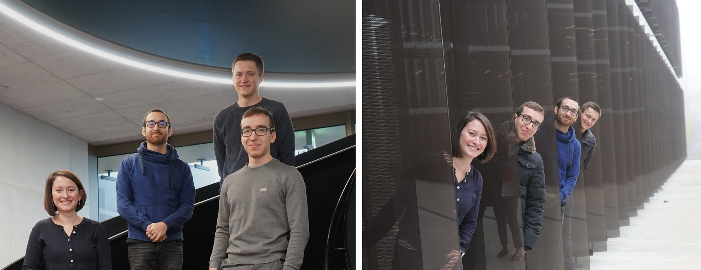

::: {.columns}
::: {.column width="38%"}
::: {.hero-text}
## Enzymology and Enzyme Engineering {.hero-title}

### Deliz Liang Lab {.hero-subtitle}
:::
:::

::: {.column width="62%"}
{.hero-image}
:::
:::

## Our Research Focus

::: {.columns}
::: {.column width="60%"}
Proteins are essential elements of life, and proteins that catalyze chemical reactions (enzymes) enable critical cellular processes. Unlike many reactions in synthetic chemistry, enzymes can catalyze complex transformations under ambient conditions. Thus, the study of enzymes (enzymology) and their engineering can allow us to better understand, repurpose, and re-engineer enzymes for target functions in green chemistry, bioremediation, therapeutics, and much more.

Enzyme engineering can be achieved by changing the amino acid sequence of proteins and enzymes. Our laboratory is focused on fundamental research towards understanding enzyme function and new applications in protein engineering. Towards these goals, we take a highly interdisciplinary approach, drawing on methodologies from chemistry, biology, and informatics.

[Learn more →](research.qmd)
:::

::: {.column width="40%"}

:::
:::

---

## The Team

::: {.columns}
::: {.column width="40%"}

:::

::: {.column width="60%"}
Our close-knit team is dedicated to conducting rigorous science and to finding joy in the daily tedium of laboratory work.

Rigor, creativity, and persistence are key features of how our team addresses scientific questions, develops new tools, and explores the field of enzyme engineering.

[Meet the team →](team.qmd)
:::
:::
