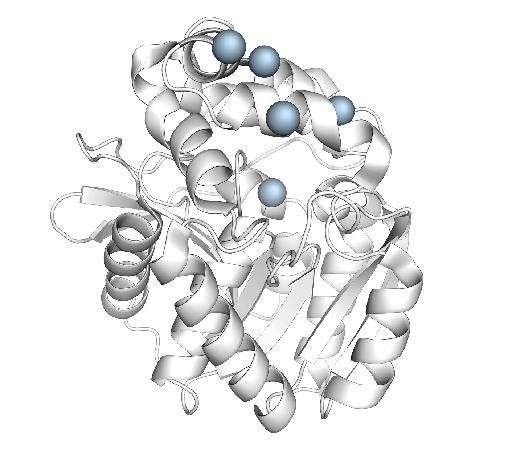
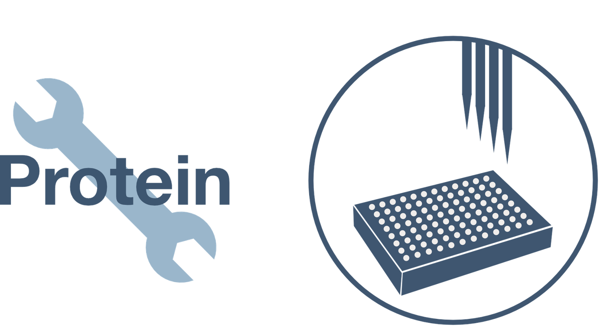
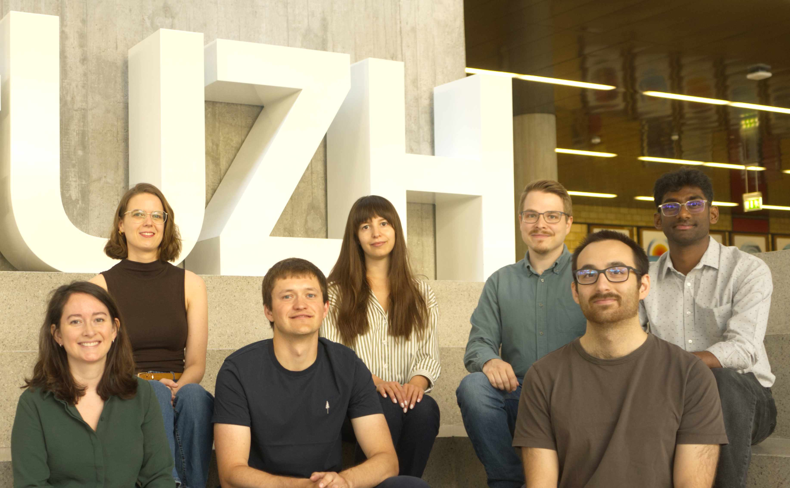

::: {.columns}
::: {.column width="38%"}
::: {.hero-text}
## Enzymology and Enzyme Engineering {.hero-title}

### Deliz Liang Lab {.hero-subtitle}
:::
:::

::: {.column width="62%"}
{.hero-image}
:::
:::

## Our Research Focus

::: {.columns}
::: {.column width="60%"}
Proteins are essential elements of life, and proteins that catalyze chemical reactions (enzymes) enable critical cellular processes. 
Unlike many reactions in synthetic chemistry, enzymes can catalyze complex transformations under ambient conditions. 
At our core, our laboratory is focused on fundamental enzymology (the study of enzyme function). 
Understanding enzyme function can enable us to better understand, repurpose, and re-engineer enzymes 
for target functions in green chemistry, bioremediation, therapeutics, and much more.

When researchers want to understand or engineer an enzyme, the amino acid sequence of the enzyme is often changed to evaluate how these changes impact enzyme function. 
To advance our ability to study and engineer enzymes, our laboratory develops new tools for engineering enzymes through [genetic code expansion](https://www.adl-lab.com/research.html#genetic-incorporation-of-non-canonical-amino-acids-ncaas). 
Towards these goals, we take a highly interdisciplinary approach, drawing on methodologies from chemistry, biology, and informatics.

[Learn more →](research.qmd)
:::

::: {.column width="40%"}

:::
:::

---

## The Team

::: {.columns}
::: {.column width="40%"}

:::

::: {.column width="60%"}
Our close-knit team is focused on conducting rigorous science while finding joy in team work and the daily tedium of laboratory work.

Rigor, creativity, and persistence are key features of how our team addresses scientific questions, develops new tools, 
and explores the fields of enzymology and enzyme engineering.

[Meet the team →](team.qmd)
:::
:::
