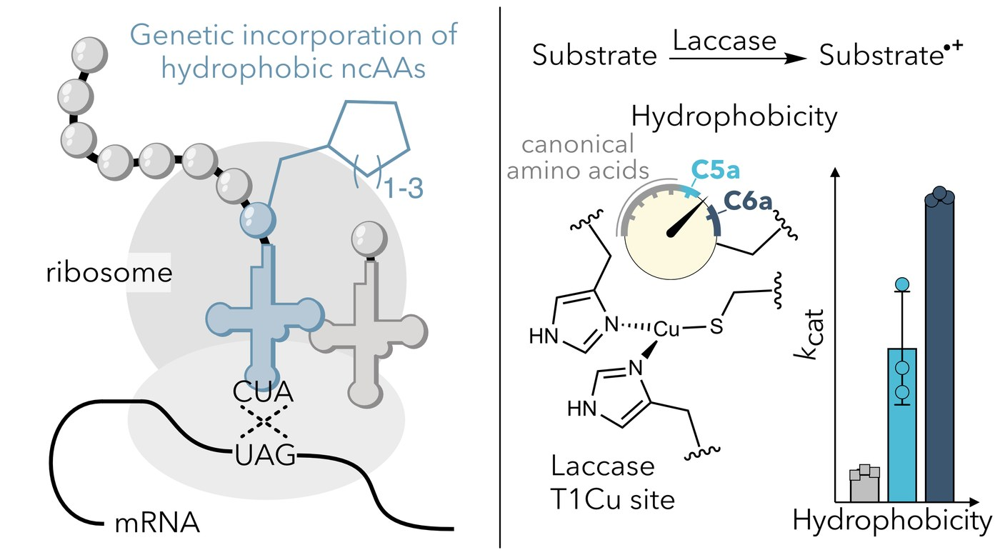
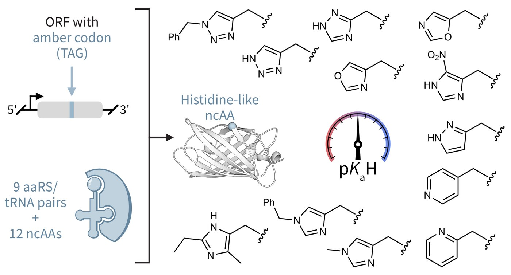
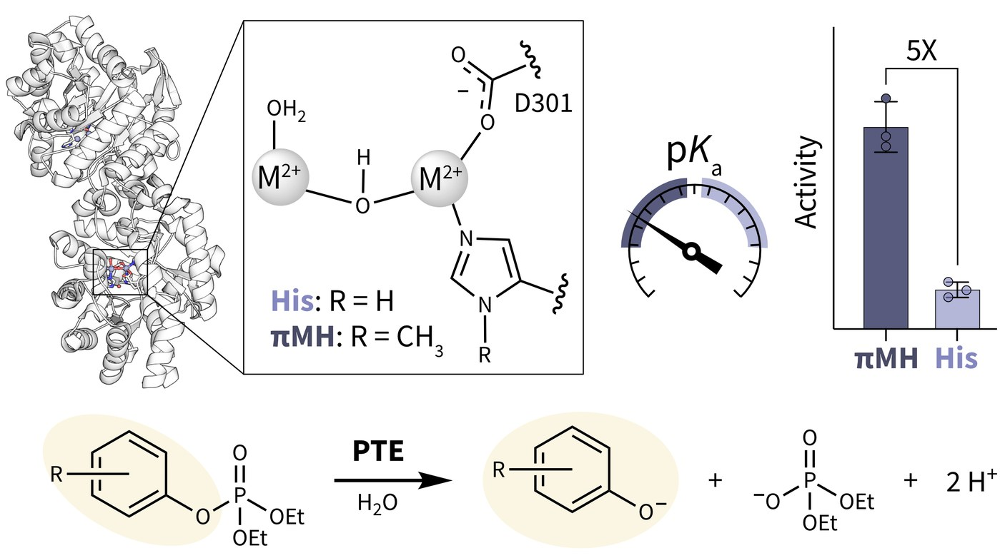
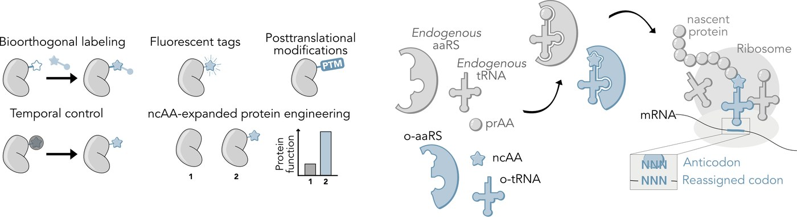

::: {.text-center}
{width="22%"}
:::

⧧ = equal contribution &nbsp;&nbsp;·&nbsp;&nbsp; \* = corresponding author

[Zenodo datasets](https://zenodo.org/search?q=metadata.creators.person_or_org.name%3A%22Deliz%20Liang%2C%20Alexandria%22&l=list&p=1&s=10&sort=bestmatch){target="_blank"} &nbsp;·&nbsp; [Addgene deposits](https://www.addgene.org/Alexandria_Deliz_Liang/){target="_blank"}

::: {.pub-entry}
::: {.columns}
::: {.column width="33%"}

:::
::: {.column width="67%"}
::: {.pub-title}
[Hydrophobic tuning with non-canonical amino acids in a copper metalloenzyme](https://www.nature.com/articles/s41557-026-02116-7){target="_blank"}
:::
::: {.pub-meta}
Fischer S⧧, Natter Perdiguero A⧧, Lau K, Deliz Liang A\*. 2026, *Nature Chemistry*. DOI: 10.1038/s41557-026-02116-7 · BioRxiv: 10.1101/2025.02.09.636911
:::
::: {.pub-links}
[Dataset](https://zenodo.org/records/18271154){target="_blank"} · [Plasmids](https://www.addgene.org/browse/article/28263974/){target="_blank"}
:::
:::
:::
:::

::: {.pub-entry}
::: {.columns}
::: {.column width="33%"}

:::
::: {.column width="67%"}
::: {.pub-title}
[Genetic incorporation of diverse non-canonical amino acids for histidine substitution](https://pubs.acs.org/doi/10.1021/jacs.5c19599){target="_blank"}
:::
::: {.pub-meta}
Natter Perdiguero A⧧, Fischer S⧧, Lischke AR, Manser BP, Deliz Liang A\*. 2026, *JACS*. DOI: 10.1021/jacs.5c19599 · BioRxiv 2025: 10.1101/2025.11.04.686677
:::
::: {.pub-links}
[Dataset](https://zenodo.org/records/18773764){target="_blank"} · [Plasmids](https://www.addgene.org/browse/article/28273117/){target="_blank"}
:::
:::
:::
:::

::: {.pub-entry}
::: {.columns}
::: {.column width="33%"}

:::
::: {.column width="67%"}
::: {.pub-title}
[Catalytic pKa Attenuation in a Hydrolytic Metalloenzyme by Genetic Code Expansion](https://pubs.acs.org/doi/10.1021/acs.biochem.5c00768){target="_blank"}
:::
::: {.pub-meta}
Manser BP, Deliz Liang A\*. 2026, *Biochemistry*. DOI: 10.1021/acs.biochem.5c00768
:::
::: {.pub-links}
[Dataset](https://zenodo.org/records/18414616){target="_blank"}
:::
:::
:::
:::

::: {.pub-entry}
::: {.columns}
::: {.column width="33%"}

:::
::: {.column width="67%"}
::: {.pub-title}
[Practical Approaches to Genetic Code Expansion with Aminoacyl-tRNA Synthetase/tRNA Pairs](https://www.chimia.ch/chimia/article/view/2024_22){target="_blank"}
:::
::: {.pub-meta}
Natter Perdiguero A, Deliz Liang A\*. *CHIMIA* 2024, 78, 22. DOI: 10.2533/chimia.2024.22
:::
:::
:::
:::

::: {.pub-entry}
::: {.pub-title}
[HaloTag Engineering for Enhanced Fluorogenicity and Kinetics with a Styrylpyridium Dye](https://chemistry-europe.onlinelibrary.wiley.com/doi/full/10.1002/cbic.202100424){target="_blank"}
:::
::: {.pub-meta}
Miró-Vinyals C, Stein A, Fischer S, Ward TR, Deliz Liang A\*. *ChemBioChem*. 2021. DOI: 10.1002/cbic.202100424
:::
:::

::: {.pub-entry}
::: {.pub-title}
[Engineering a Metathesis-Catalyzing Artificial Metalloenzyme Based on HaloTag](https://pubs.acs.org/doi/10.1021/acscatal.1c01470){target="_blank"}
:::
::: {.pub-meta}
Fischer S, Ward TR\*, Deliz Liang A\*. *ACS Catalysis*. 2021, 11, 6343.
:::
:::

::: {.pub-entry}
::: {.pub-title}
[Ultrahigh-Throughput Screening of an Artificial Metalloenzyme using Double Emulsions](https://onlinelibrary.wiley.com/doi/full/10.1002/anie.202207328){target="_blank"}
:::
::: {.pub-meta}
Vallapurackal J, Stucki A, Deliz Liang A, Klehr J, Dittrich PS, Ward TR. *Angew. Chem., Int. Ed.* 2022.
:::
:::

::: {.pub-entry}
::: {.pub-title}
[Incorporation of metal-chelating unnatural amino acids into halotag for allylic deamination](https://www.sciencedirect.com/science/article/pii/S0022328X22000201){target="_blank"}
:::
::: {.pub-meta}
Stein A, Deliz Liang A, Sahin R, Ward TR. *J. Organomet. Chem.* 2022, 962, 122272.
:::
:::

::: {.pub-entry}
::: {.pub-title}
[Artificial Metalloenzymes Based on the Biotin-Streptavidin Technology: Enzymatic Cascades and Directed Evolution](https://pubs.acs.org/doi/10.1021/acs.accounts.8b00618){target="_blank"}
:::
::: {.pub-meta}
Liang AD, Serrano-Plana J, Petterson RL, Ward TR. *Acc. Chem. Res.* 2019, 52, 585.
:::
:::

::: {.pub-entry}
::: {.pub-title}
[Genetically Encoded Protein Phosphorylation in Mammalian Cells](https://www.sciencedirect.com/science/article/pii/S2451945618301843?via%3Dihub){target="_blank"}
:::
::: {.pub-meta}
Beranek V, Reinkemeier CD, Zhang MS, Liang AD, Kym G, Chin JW. *Cell Chem. Biol.* 2018, 25, 1067.
:::
:::

::: {.pub-entry}
::: {.pub-title}
[Biosynthesis and Genetic Encoding of Phosphothreonine through Parallel Selections and Deep Sequencing](https://www.nature.com/articles/nmeth.4302){target="_blank"}
:::
::: {.pub-meta}
Zhang SM, Brunner SF, Huguenin-Dezot N, Liang AD, Schmied WH, Rogerson DT, Chin JW. *Nat. Methods*. 2017, 14, 729.
:::
:::

::: {.pub-entry}
::: {.pub-title}
[Single Turnover Reveals Oxygenated Intermediates in Toluene/o-Xylene Monooxygenase in the Presence of the Native Redox Partners](https://pubs.acs.org/doi/10.1021/jacs.5b07055){target="_blank"}
:::
::: {.pub-meta}
Liang AD, Lippard SJ. *J. Am. Chem. Soc.* 2015, 137, 10520.
:::
:::

::: {.pub-entry}
::: {.pub-title}
[Coupling Oxygen Consumption with Hydrocarbon Oxidation in Bacterial Multicomponent Monooxygenases](https://pubs.acs.org/doi/10.1021/acs.accounts.5b00312){target="_blank"}
:::
::: {.pub-meta}
Wang W, Liang AD, Lippard SJ. *Acc. Chem. Res.* 2015, 48, 2632.
:::
:::

::: {.pub-entry}
::: {.pub-title}
[Solid-Phase Synthesis Provides a Modular, Lysine-Based Platform for Fluorescent Discrimination of Nitroxyl and Biological Thiols](https://pubs.rsc.org/en/content/articlelanding/2015/sc/c5sc00880h){target="_blank"}
:::
::: {.pub-meta}
Loas A, Radford RJ, Liang AD, Lippard SJ. *Chem. Sci.* 2015, 6, 4131.
:::
:::

::: {.pub-entry}
::: {.pub-title}
[Component Interactions and Electron Transfer in Toluene/o-Xylene Monooxygenase](https://pubs.acs.org/doi/10.1021/bi500892n){target="_blank"}
:::
::: {.pub-meta}
Liang AD, Lippard SJ. *Biochemistry* 2014, 53, 7368.
:::
:::

::: {.pub-entry}
::: {.pub-title}
[A Flexible Glutamine Regulates Catalytic Function of Toluene/o-Xylene Monooxygenase](https://pubs.acs.org/doi/10.1021/bi500387y){target="_blank"}
:::
::: {.pub-meta}
Liang AD, Wrobel AT, Lippard SJ. *Biochemistry* 2014, 53, 3585.
:::
:::

::: {.pub-entry}
::: {.pub-title}
[A Fast and Selective Near-Infrared Fluorescent Sensor for Multicolor Imaging of Biological Nitroxyl](https://pubs.acs.org/doi/10.1021/ja500315x){target="_blank"}
:::
::: {.pub-meta}
Wrobel WT, Johnstone TC, Liang AD, Lippard SJ, Rivera-Fuentes P. *J. Am. Chem. Soc.* 2014, 136, 4697.
:::
:::

::: {.pub-entry}
::: {.pub-title}
[Tyrosyl Radicals in Dehaloperoxidase: How Nature Deals with Evolving an Oxygen-Binding Globin to a Biologically Relevant Peroxidase](https://www.sciencedirect.com/science/article/pii/S0021925819544702){target="_blank"}
:::
::: {.pub-meta}
Dumarieh R, D'Antonio J, Deliz-Liang A, Smirnova T, Svistunenko DA, Ghiladi RA. *J. Biol. Chem.* 2013, 288, 33470.
:::
:::
