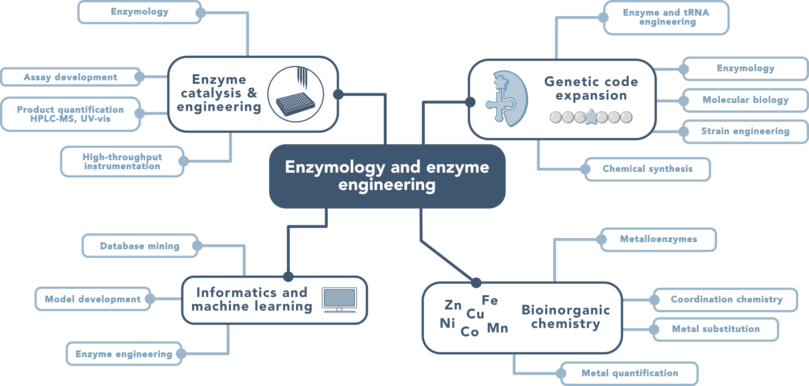
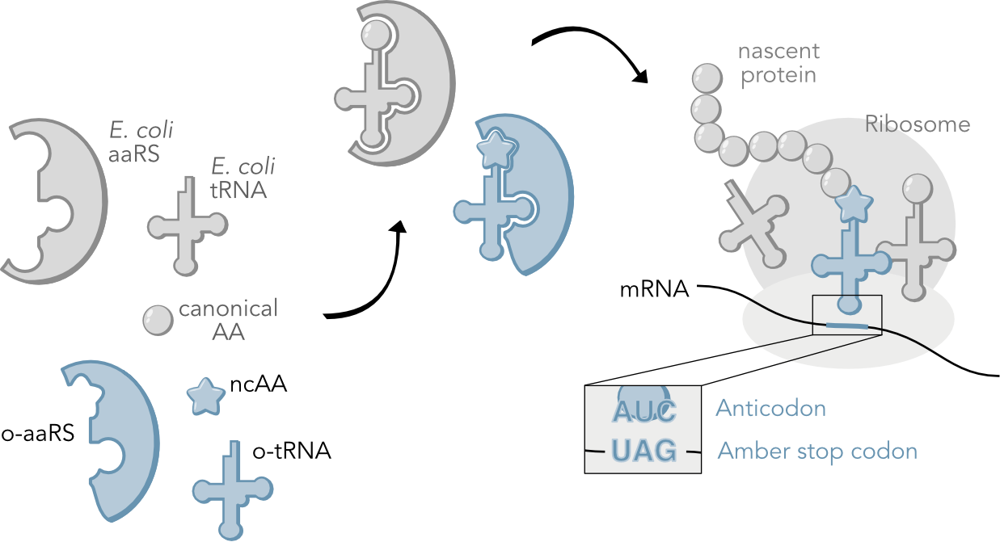

## Research map

{fig-alt="Overview map of the lab's research areas"}

## Fundamentals

### Genetic incorporation of non-canonical amino acids (ncAAs)

{.figure-float-right fig-alt="Scheme of genetic code expansion for ncAA incorporation"}

To create proteins, nature uses a set of 20 amino acids (called canonical amino acids) throughout all of life. 
Even with this limited toolkit, a wide variety of functions can be achieved. 
However, chemical and molecular biologists have developed techniques for expanding this set of 20 amino acids to enable incorporation of hundreds of non-canonical amino acids (**ncAAs**). 
This feat is achieved by augmenting nature's natural system for protein generation.

In the first steps of protein synthesis, an aminoacyl-tRNA synthetase (**aaRS**) enzyme binds to a canonical amino acid and its partner/cognate **tRNA**. 
The aaRS catalyzes the covalent attachment of the canonical amino acid to its cognate tRNA (aminoacylation or charging). 
The aminoacylated tRNA is trafficked to the ribosome, where it is used to decode mRNA to create a protein. 
The anticodon of the tRNA can hydrogen bond to specific codons in the mRNA, which links the mRNA sequence to the final protein sequence.

For ncAA incorporation, we evolve an orthogonal aaRS/tRNA pair (**o-aaRS** and **o-tRNA**) to recognize a target ncAA and decode an infrequently used codon (typically the amber stop codon).

::: {.clear-float}
:::

<!--
Need to add other sections later
-->
