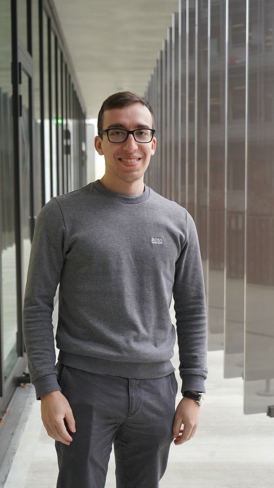

::: {.columns}
::: {.column width="30%"}

:::

::: {.column width="70%"}
My passion in chemistry was sparked in high-school and led me to study chemistry at the University of Basel, where I obtained my Bachelor's and Master's degree. For my Master's thesis I joined the group of Prof. Thomas R. Ward where I worked on artificial metalloenzymes based on the biotin-streptavidin technology which introduced me to biochemistry. Intrigued by the field of biochemistry I decided to join Ali, whom I met during my time in the Ward lab, for a PhD in Zurich.

Outside of the lab I enjoy cooking, skiing and hiking, as well as playing computer games and drinking a beer with friends.

**Publications**

- Manser BP, Deliz Liang A\*. "Catalytic pKa Attenuation in a Hydrolytic Metalloenzyme by Genetic Code Expansion." *Biochemistry*, 2026.
- Natter Perdiguero A⧧, Fischer S⧧, Lischke AR, Manser BP, Deliz Liang A\*. "Genetic incorporation of diverse non-canonical amino acids for histidine substitution." *JACS*, 2026.
:::
:::

[← Back to team](../team.qmd)
