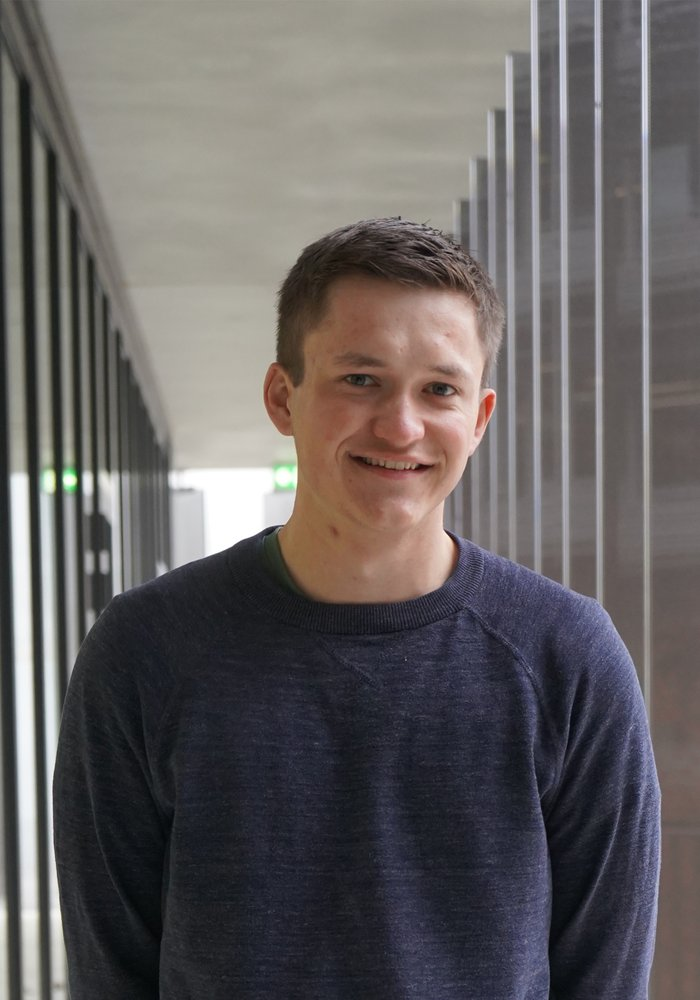

::: {.columns}
::: {.column width="30%"}

:::

::: {.column width="70%"}
I got my Bachelor's degree in Chemistry at the University of Basel and stayed there to continue with a Master's degree. 
Becoming more interested in biochemistry, I joined the group of Prof. Thomas R. Ward for my master thesis. 
There, I worked on the development of a metathesis catalyzing artificial metalloenzyme based on HaloTag. 
During this project, I was supervised by Ali, whom I followed to Zürich to pursue a PhD.

In my free time, I love playing tennis and doing sport in general, playing cards and board games, and drinking a beer with friends.

**PhD Publications**

- Natter Perdiguero A⧧, **Fischer S**⧧, Lischke AR, Manser BP, Deliz Liang A\*. "Genetic incorporation of diverse non-canonical amino acids for histidine substitution." *JACS*, 2026.
- **Fischer S**⧧, Natter Perdiguero A⧧, Lau K, Deliz Liang A\*. "Hydrophobic tuning with non-canonical amino acids in a copper metalloenzyme" *Nature Chemistry*. 2026

**Current employer**
Lonza

:::
:::

[← Back to team](../team.qmd)

